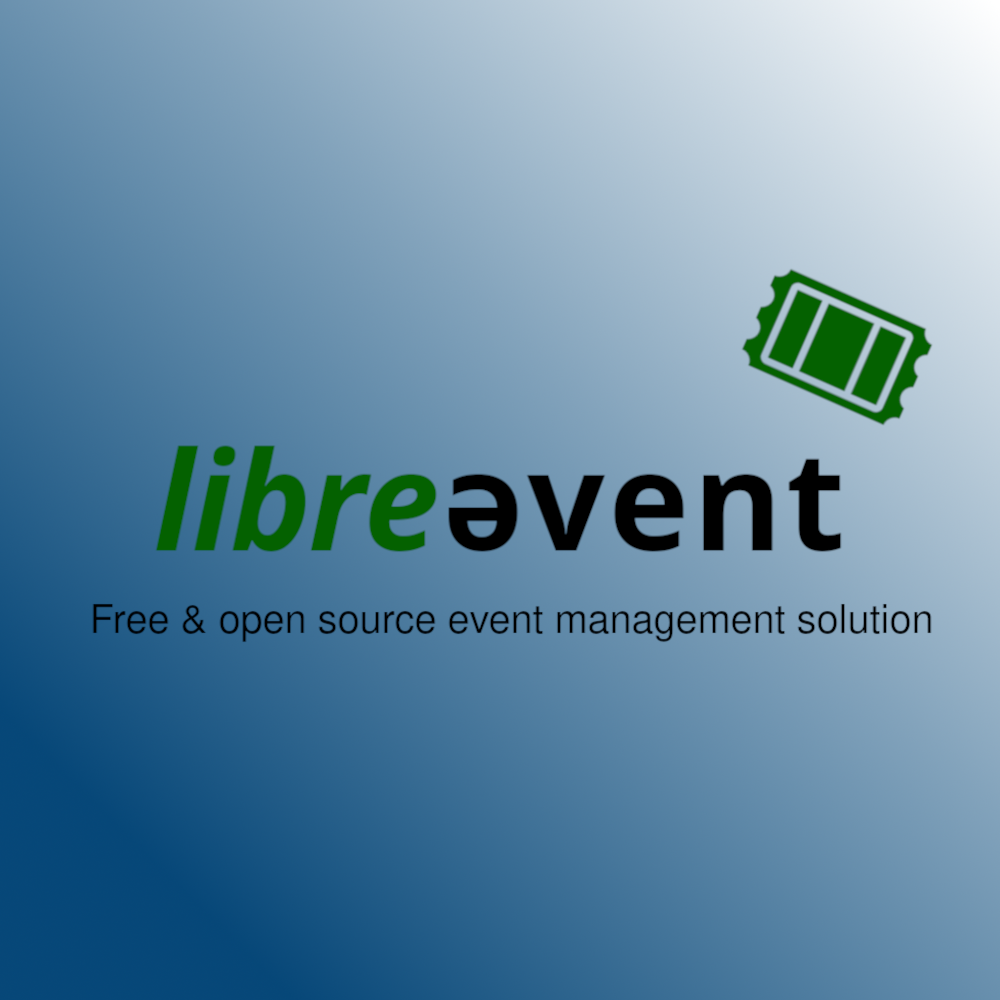

    
    <h1>myevent</h1>

    
    
    
    

A fully featured, fully free and open source event management solution you can host yourself, to manage your event and sell tickets. All you need is a webserver that can run node.js!

Visit our [website](https://myevent.janishutz.com)

## This project is currently NOT ready to be used! 
Development of this project is currently ongoing and no stable version is available yet. 

## ROADMAP
The goal is to get this tool fully functioning by the End of September 2023.